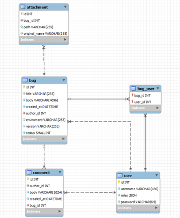

# Instrukcja instalacji

PHP >8.3.4, Symfony >6.4.8
 
* cd Bugtracker
*	composer install
*	Wybrać odpowiednią bazę danych w .env
*	php bin/console make:migration
*	php bin/console doctrine:migrations:migrate
*	php bin/console doctrine:fixtures:load
*	chmod 777 public/uploads
*	symfony server:start

Użytkownik ‘admin’ ma hasło ‘admin’

Strona dostępna pod linkiem https://wierzba.wzks.uj.edu.pl/~21_bacza/Bugtracker/

# Schemat bazy danych

